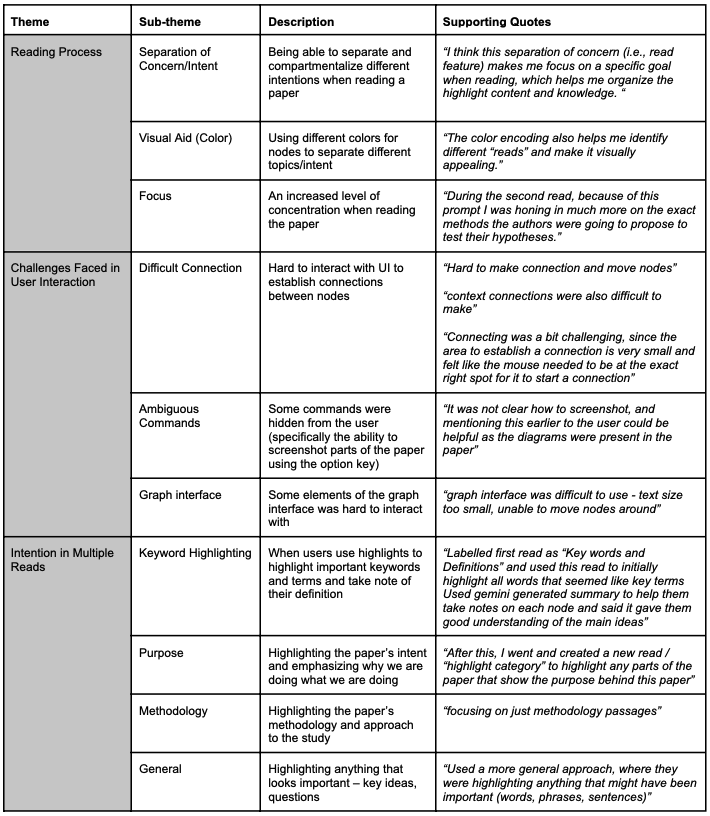

# Core assignment: Evaluation [+10] Group

Phase: Evaluation

Due date: Friday, March 14 at 11:59pm PT

The goal of this stage of the project is to evaluate your high-fidelity prototype with potential users. 

Course learning objectives this assignment facilitates: (1) Create an interactive system grounded in user research, iterative prototyping, and evaluation; (2) Explore and express complex problems, design choices; and (3) Reflect on what you know, don’t know, and how to learn what you don’t know. 

Grading: This is a group assignment. All members of the group are expected to participate fully. Each group will receive one grade. / 

Every member will receive the same number of points.

What to submit: Add a .MD file in your Github repo with the responses to the following questions. Submit the github repo link to BruinLearn. Only one person needs to submit for the group.

## Conducting user evaluation [+5]

Your goal is to assess the usability of your system. 

*[+5] Evaluate your system with at least 10 participants. Write and submit 0.5-1p of notes for each participant.*
*[+1] DEPTH: Evaluate with 5 more participants. Feel free to make changes to your system between the first and second round of evaluation. If you do make changes, summarize the changes you made and why. *

## After your evaluation [+4]

*[+4] Analyze your data and write up your key findings. The findings should be about 0.5-1p for each motivating question and any other interesting findings.*

*For any qualitative data where you cannot easily remember the details of the results, a thematic analysis is required. When you conduct a thematic analysis, include your codebook.*

Regarding our first motivating question, which was “How does our interface enable users to capture and externalize their cognitive goals while reading data-intensive scientific papers?” We found that the interface we created allowed individuals to not only feel decluttered when reading research papers, but also be more intentional with their reading process. The labels they chose were very specific, such as “methodology”, “definitions”, “purpose”, and with this level of specificity, readers were able to be more targeted with their reading, and now reading becomes this iterative process that users can continuously build their understanding on. Previously, users expressed that research papers were hard to follow, as information is very densely packed but ideas were scattered throughout the paper. We were glad that users are now able to be more constructive when reading papers.

In addition, the LLM assistance provided by the Gemini API acted as training wheels for a lot of users that had minimal familiarity with the content being discussed. On the first skim, users would use the Gemini-generated responses to build their contextual knowledge of the paper, which allowed a smoother reading experience in subsequent reads. Moreover, the notes section allowed them to not only record Gemini’s help, but also draw from previous knowledge, as one user mentions they “took notes as they went with the help of previous background knowledge as well as Gemini assistance.” 

Regarding our second motivating question, which was “What is the efficacy of our interface in bridging different cognitive goals across multiple reading sessions? Further, do users use the multiple reads feature through its intended purpose, or do they use their own approach?”, we had an interesting mix of different use cases for the multiple reading sessions. Our users used the reads for highlighting different keywords/ideas, intention, methodologies, and some even had a more general approach where they highlighted anything that was generally important. In cases where users split reads based on intention, it was clear that users felt more focused when reading, as well as stating that the reading process becomes more smooth as your thoughts can be easily traced back and visualized via the graph. Although our interface was built to split intention, it was interesting to see how users imposed their own use cases. For example, a user decided to use a reading session as an opportunity to solely focus on highlighting keywords and collecting definitions before doing a more thorough reading. This helped them understand the paper better on their second read, as they felt more familiar with the terms, and could now read with momentum. 

In terms of the user interface, the task of connecting and bridging nodes between two different reading sessions was challenging for some users. As one user mentions, “context connections were also difficult to make”, and another user mentioned “drag dot-to-dot is a pain point.’ From our observation, this was due to the small area where a user was able to click on a node to start establishing a connection. This barrier in our interface could hinder users from effectively bridging connecting different cognitive goals. To fix this, we need to make the clickable area much larger and also more apparent, so it is able to inherently prompt the user to start connecting nodes. 

**THEMATIC ANALYSIS CODEBOOK**

*For any quantitative data, submit a script for analysis + your data. Recommendation: Create a notebook for your analysis. Someone should be able to run your notebook to reproduce your results.* 

Quantitative analysis can be found at this [Google Collab Notebook](https://colab.research.google.com/drive/1QD6xpcWPQtXFO9rnTCll7IVluforOVYl?usp=sharing). We also included the dataset and corresponding .ipynb file in our repository.

## Group Reflection [+1]

*What is one thing that went well in your evaluation?*

We were pleasantly surprised by the positivity that most of our evaluation participants had when using our tool. When asked about how useful they found our tool, most participants provided a value of 7/10 or above. Adding off of this, we saw a diverse range of graphs that were created based on user highlights and that every user’s approach was quite unique, underscoring the potential our tool has.

*What is one thing that you wish you could have done differently?*

The variety with which people approached using our tool was a double-edged sword. Particularly when performing a quantitative analysis of the evaluation results, we felt that the open-ended nature of our tool coupled with the time constraints of the evaluation period meant that we were not able to identify any real trends within the data we collected. In the end, our quantitative study was more of a proof of concept for what we might have been able to do with a more comprehensive evaluation protocol and more time to carry out this protocol.

*How, if at all, did your participants represent the personas you intended to design for?*

Our personas were well-represented during the evaluation study. The first persona, Jack, was represented by the multiple undergraduate students we evaluated who encounter papers on a regular basis but do not necessarily require a large depth of understanding. The second persona, Violet, was represented by the multiple Masters and PhD students we evaluated, who both encounter papers on a regular basis and require a more thorough understanding.

*How do you think this impacted your results?*

We noticed the more experienced users (those similar to Violet’s persona) seemed to use our tool with more authority. They generally took more advantage of the contextual linking feature, and explored meaningful ways they could incorporate the tool into their pre-existing workflows. Contrastingly, participants that aligned with Jack’s persona tended to ask more questions/use the tool in the way that we intended/directed them to use it.

*Based on the above, what does this say about the potential applicability of your system?*

Our tool is open-ended enough that it would accommodate both of our personas well. Specifically, the tool may accommodate a wide range of experience levels. We may need to add more tutorial-like features to help less-experienced users navigate through/develop a functioning workflow.

*What new questions do you have based on your evaluation? *

We are mostly interested in what insights we may derive from an expanded quantitative study. We have developed a schema to represent highlight/connection data thoroughly, but simply lack enough data to derive meaningful insights about the trends how highlight type and structure change depending on specific cognitive goals.

*Did you use a generative AI tool for this assignment? If so, which tool(s) and how?*

ChatGPT was used to style the plots in our quantitative evaluation.

*How much time did you spend on this assignment as a group? individually?*

- Group: 3 hours each to perform evaluations, 1 hour as a group to discuss evaluations results.
- Brian and Ollie: 2 hours each to do Evaluation Core Assignment Writeup.
- Michael and Yuwei: 2 hours each to design poster.